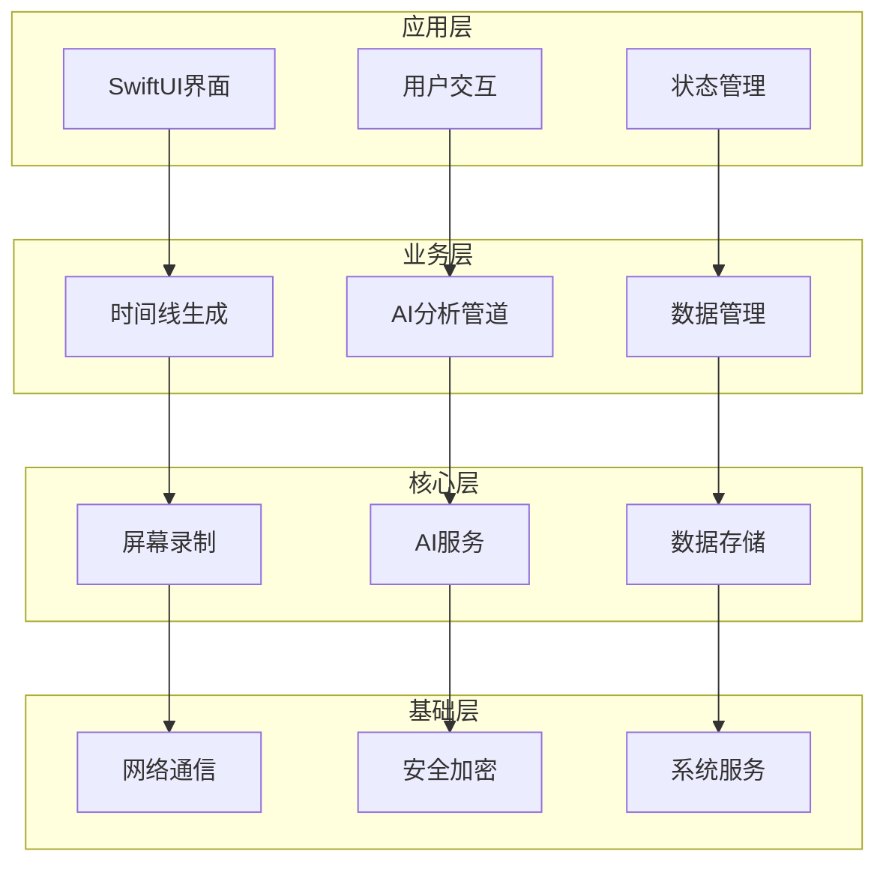

# Dayflow 中文版项目索引

## 📋 项目概览

### 基本信息
- **项目名称**: Dayflow CN (Dayflow 中文版)
- **基于项目**: [Dayflow](https://github.com/JerryZLiu/Dayflow) by Jerry Liu
- **许可协议**: MIT License
- **开发语言**: Swift
- **UI框架**: SwiftUI
- **平台支持**: macOS 13.0+

### 核心特性
- 🎥 **低功耗录制**: 1 FPS 屏幕录制，最小化资源占用
- 🤖 **AI智能分析**: 支持 Gemini 和本地模型
- 🌏 **完整中文化**: UI界面和AI提示词全面本地化
- 📊 **智能时间线**: 自动生成工作活动时间线
- 🔒 **隐私优先**: 用户完全控制数据存储和AI选择

## 📁 项目结构

```
Dayflow/
├── 📄 项目文档
│   ├── README.md              # 英文原版说明
│   ├── README_CN.md           # 中文版详细说明 ⭐
│   ├── LICENSE                # MIT许可证
│   ├── LICENSE_CN.md          # MIT许可证中文说明 ⭐
│   ├── DEVELOPMENT.md         # 开发指南 ⭐
│   ├── PROJECT_INDEX.md       # 项目索引（当前文件）
│   └── CLAUDE.md             # 项目架构总览
│
├── 🔧 构建和部署
│   ├── build-dev-final.sh     # 中文版构建脚本
│   ├── Dayflow.xcodeproj      # Xcode项目文件
│   └── build-dev/             # 构建输出目录
│       ├── Dayflow CN.app     # 中文版应用
│       └── Dayflow_CN_v*.zip  # 发布包
│
├── 💻 源代码 (Dayflow/)
│   ├── 📱 App/                # 应用入口和生命周期
│   ├── ⚙️ Core/               # 核心功能模块
│   │   ├── Recording/         # 屏幕录制功能
│   │   ├── AI/               # AI分析和LLM集成
│   │   ├── Analysis/         # 时间线分析和生成
│   │   ├── Net/              # 网络服务
│   │   ├── Security/         # 安全存储
│   │   └── Thumbnails/       # 缩略图生成
│   ├── 🎨 Views/             # 用户界面
│   │   ├── UI/               # 主要UI组件
│   │   ├── Components/       # 可复用组件
│   │   └── Onboarding/       # 新用户引导
│   ├── 📊 Models/            # 数据模型和业务实体
│   ├── 🔧 System/            # 系级服务
│   ├── 🛠️ Utilities/        # 工具类和扩展
│   └── 📋 Menu/              # 菜单栏和状态栏
│
├── 📚 文档和资源
│   └── docs/                 # 项目文档资源
│       ├── images/          # 截图和演示图
│       └── videos/          # 演示视频
│
└── 🧪 测试和脚本
    └── scripts/             # 自动化脚本
```

## 🏗️ 核心架构

### 分层架构设计



### 关键模块说明

#### 🎥 录制模块 (Core/Recording)
- **ScreenRecorder.swift**: 屏幕录制核心逻辑
- **StorageManager.swift**: 录制文件存储管理
- **VideoProcessingService.swift**: 视频处理和压缩

#### 🤖 AI模块 (Core/AI)
- **LLMService.swift**: AI服务统一接口
- **GeminiDirectProvider.swift**: Gemini AI集成
- **OllamaProvider.swift**: 本地模型集成
- **GeminiPromptPreferences.swift**: Gemini提示词配置
- **OllamaPromptPreferences.swift**: 本地模型提示词配置

#### 📊 分析模块 (Core/Analysis)
- **AnalysisManager.swift**: 分析管理器
- **TimeParsing.swift**: 时间解析工具

#### 🎨 UI模块 (Views)
- **MainView.swift**: 主界面
- **DashboardView.swift**: 仪表板界面
- **JournalView.swift**: 日志界面
- **SettingsView.swift**: 设置界面
- **TimelineDataView.swift**: 时间线数据展示

## 🌏 中文版特色功能

### 1. 完整本地化
- ✅ 所有UI元素中文化
- ✅ 设置页面中文说明
- ✅ 错误信息和提示中文化
- ✅ 菜单和快捷键中文标注

### 2. AI提示词优化
- ✅ 针对中文场景优化的分析提示词
- ✅ 中文应用和软件识别能力
- ✅ 中文内容分析和分类
- ✅ 更符合中文表达习惯的摘要生成

### 3. 本土化体验
- ✅ 中文应用名称识别（微信、钉钉、飞书等）
- ✅ 中文网页内容分析
- ✅ 符合中国用户习惯的时间显示
- ✅ 中文工作场景分类建议

## 🚀 快速开始

### 环境要求
- macOS 13.0+
- Xcode 15.0+
- Swift 5.9+
- (可选) Gemini API Key

### 安装步骤

#### 用户安装
1. 下载最新版 `Dayflow_CN.dmg`
2. 拖拽到应用程序文件夹
3. 授予屏幕录制权限
4. 配置AI提供商（Gemini或本地模型）

#### 开发环境
```bash
# 克隆中文版项目
git clone https://github.com/gjwhw/Dayflow-cn.git
cd Dayflow-cn

# 切换到中文开发分支
git checkout feature/custom-build-location

# 打开Xcode
open Dayflow.xcodeproj

# 配置环境变量（可选）
# 在Run scheme中添加 GEMINI_API_KEY
```

## 🔧 开发和构建

### 构建脚本
使用自定义构建脚本支持中文版打包：

```bash
# 构建中文版
./build-dev-final.sh

# 输出文件
# - build-dev/Dayflow CN.app/
# - build-dev/Dayflow_CN_v1.1.21.zip
```

### 关键配置
- **应用名称**: Dayflow CN
- **Bundle ID**: 保持原始配置
- **签名证书**: 使用开发者证书
- **版本管理**: 独立的中文版版本号

## 📊 性能指标

### 资源使用
- **应用大小**: ~25MB
- **内存占用**: ~100MB
- **CPU使用**: <1% (空闲时)
- **存储空间**: 自动管理，3天保留期

### 录制规格
- **帧率**: 1 FPS
- **分辨率**: 原生屏幕分辨率
- **编码格式**: H.264
- **分析间隔**: 15分钟

### AI处理性能
- **Gemini**: 2次API调用，快速处理
- **本地模型**: 30+次调用，处理较慢但完全离线

## 🛡️ 安全和隐私

### 数据本地化
- ✅ 录制文件本地存储
- ✅ 可选择完全离线处理
- ✅ 自动清理过期数据
- ✅ 用户完全控制数据

### 权限最小化
- 📱 屏幕录制权限（必需）
- 🌐 网络访问（仅AI分析使用）
- 💾 文件系统访问（仅应用目录）

### 数据加密
- 🔐 API密钥安全存储
- 🔐 本地数据库加密
- 🔐 网络传输HTTPS

## 📱 支持的AI提供商

### 云端AI
- **Google Gemini**:
  - 快速处理，视频原生理解
  - 需要API密钥，数据上传到Google
  - 2次API调用，响应速度快

### 本地AI
- **Ollama**:
  - 完全离线，隐私保护
  - 需要本地运行Ollama服务
  - 30+次API调用，处理较慢

- **LM Studio**:
  - 用户友好的本地模型管理
  - 支持多种开源模型
  - 完全离线运行

## 🔮 未来规划

### 短期目标 (v1.2.0)
- 🔄 更多中文AI模型支持（通义千问、文心一言）
- 🔄 智能中文应用分类
- 🔄 本地化数据报告
- 🔄 性能优化和bug修复

### 中期目标 (v1.3.0)
- 📋 团队协作功能
- 📋 高级数据导出
- 📋 自定义分析规则
- 📋 语音识别集成

### 长期目标 (v2.0.0)
- 🚀 跨平台支持 (Windows)
- 🚀 企业级功能
- 🚀 插件系统
- 🚀 开放API

## 🤝 贡献指南

### 参与方式
1. **报告问题**: GitHub Issues
2. **功能建议**: Discussions
3. **代码贡献**: Pull Request
4. **文档完善**: 直接提交文档PR

### 开发规范
- 遵循Swift编码规范
- 使用Conventional Commits
- 保证测试覆盖率
- 代码审查通过

### 社区建设
- 👥 欢迎中文开发者参与
- 👥 重视中文用户反馈
- 👥 持续改进本地化体验

## 📞 联系方式

### 官方渠道
- **原版项目**: https://github.com/JerryZLiu/Dayflow
- **中文版项目**: https://github.com/gjwhw/Dayflow-cn
- **问题反馈**: https://github.com/gjwhw/Dayflow-cn/issues
- **功能讨论**: https://github.com/gjwhw/Dayflow-cn/discussions

### 中文版维护
- 基于原版的社区维护版本
- 遵循MIT许可证开源协议
- 致力于服务中文用户群体
- 独立的中文版仓库和开发流程

---

**让AI更好地理解中文工作场景，打造最适合中国用户的时间管理助手！** 🇨🇳

*最后更新: 2025年11月*