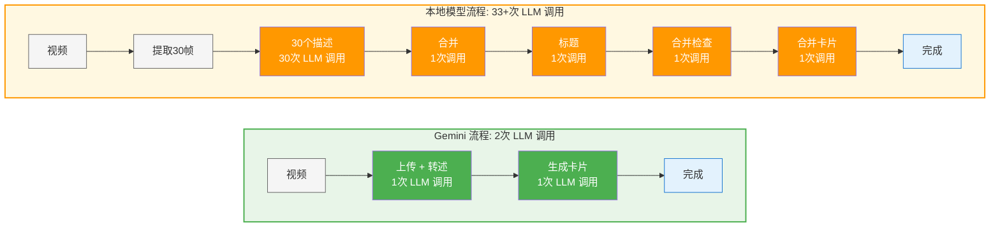

# Dayflow 中文版 - 您的AI工作日记录助手

> **📢 重要说明：这是 Dayflow 的中文翻译版本**
>
> 本项目是 [Dayflow](https://github.com/JerryZLiu/Dayflow) 的中文本地化版本，主要提供：
> - ✅ 完整的中文界面和用户体验
> - ✅ 针对中文用户优化的AI提示词
> - ✅ 中文应用和内容的识别增强
> - 🔗 **原版项目**: [https://github.com/JerryZLiu/Dayflow](https://github.com/JerryZLiu/Dayflow)
>
> 后续可能会根据中文用户需求迭代一些本地化功能。

<div align="center">
  
</div>

<div align="center">
  <em>自动生成您的工作日时间线</em><br>
  通过AI分析屏幕活动，生成包含智能摘要和干扰提醒的清晰时间线
</div>

<div align="center">
  <!-- Badges -->
  <a href="https://github.com/JerryZLiu/Dayflow">
    
  </a>
  
  
  
  
  
</div>

<div align="center">
  
</div>

<div align="center">
  <a href="https://github.com/JerryZLiu/Dayflow/releases/latest">
    
  </a>
</div>

<p align="center">
  <a href="#dayflow是什么">功能介绍</a> •
  <a href="#为什么选择中文版">中文版特色</a> •
  <a href="#主要功能">核心功能</a> •
  <a href="#工作原理">技术原理</a> •
  <a href="#安装使用">安装指南</a> •
  <a href="#数据隐私">隐私保护</a> •
  <a href="#自动化集成">自动化集成</a> •
  <a href="#开发调试">开发工具</a> •
  <a href="#项目结构">代码结构</a> •
  <a href="#贡献指南">参与贡献</a>
</p>

---

## Dayflow 是什么？

Dayflow 是一款**原生 macOS 应用**（SwiftUI），以 **1 FPS** 录制屏幕，**每15分钟**用AI分析一次，生成您工作活动的**智能时间线**。

应用轻量级（25MB），仅需约100MB内存和<1%的CPU。

> _隐私优先设计_：您可以选择AI提供商。使用**Gemini**（自带API密钥）或**本地模型**（Ollama / LM Studio）。详见**数据隐私**部分。

## 为什么选择中文版？

### 🌟 这是原版的中文翻译版本

我们专注于将优秀的 Dayflow 带给中文用户，主要提供：

### 🇨🇳 完整中文化
- **界面全中文**：所有UI元素、菜单、设置均已中文化
- **AI提示词优化**：针对中文使用场景优化了AI分析提示词
- **符合中文习惯**：时间显示、活动分类更贴近中国用户习惯

### 🚀 本土化增强
- **更好的中文理解**：AI分析更准确地理解中文应用和内容
- **本地化体验**：支持中文应用名称和软件分类识别
- **持续优化**：专门针对中文用户的使用反馈进行改进

### 🔄 版本同步
- **保持更新**：及时同步原版的功能更新和安全修复
- **基础功能**：核心功能与原版保持一致
- **本地化迭代**：根据中文用户需求可能会添加一些本地化功能

> 💡 **推荐用户**：如果您是中文用户，希望获得更友好的中文体验，欢迎使用本中文版。如果您需要最新的原版功能或希望参与原版开发，请访问[原版项目](https://github.com/JerryZLiu/Dayflow)。

---

## 主要功能

- **智能时间线**：自动生成您的工作日时间线和活动摘要
- **低资源占用**：1 FPS录制，最小化CPU和存储影响
- **定时分析**：每15分钟分析一次，及时更新活动状态
- **工作日回放**：观看您一天工作的快进视频
- **自动清理**：3天后自动删除旧录制文件
- **干扰提醒**：识别并标记让您分心的事项
- **原生体验**：使用 **SwiftUI** 构建的原生 macOS 应用
- **自动更新**：集成 **Sparkle** 框架，自动检查和下载更新

### 即将推出

- **个性化仪表板** — 自定义问题追踪工作日效率，可视化趋势分析
- **每日工作日志** — 回顾AI捕获的精彩瞬间，引导反思和记录

---

## 工作原理

1) **录制** — 以1 FPS录制屏幕，按15秒分块存储
2) **分析** — 每15分钟将最近录像发送给AI分析
3) **生成** — AI创建包含活动摘要的时间线卡片
4) **展示** — 以可视化时间线展示您的一天
5) **清理** — 自动删除3天前的录制文件

### AI 处理流程

不同AI提供商的处理效率：



**Gemini** 利用原生视频理解能力直接分析，**本地模型**通过分析单帧描述重建理解 — 处理复杂度差异显著。

---

## 安装使用

### 系统要求
- macOS **13.0+**
- Xcode **15+**（开发环境）
- **Gemini API密钥**（如使用Gemini）：https://ai.google.dev/gemini-api/docs/api-key

### 安装方式

#### 📦 下载安装（推荐中文用户）

**选择1：中文版（推荐）**
1. 从本仓库 Releases 下载最新的 `Dayflow_CN.dmg`
2. 打开应用，授予**屏幕和系统音频录制**权限：
   macOS → **系统设置** → **隐私与安全性** → **屏幕和系统音频录制** → 启用 **Dayflow CN**

**选择2：原版（英文界面）**
- 如果您需要最新的原版功能，可以从[原版项目](https://github.com/JerryZLiu/Dayflow)下载

<div align="center">
  <a href="https://github.com/gjwhw/Dayflow-cn/releases">
    
  </a>
  <br>
  <small>中文版 Releases | 原版 <a href="https://github.com/JerryZLiu/Dayflow/releases">点击这里</a></small>
</div>

#### 🔧 从源码构建（开发者）
1. 安装 **Xcode 15+** 并打开 `Dayflow.xcodeproj`
2. 在 macOS 13+ 上运行 `Dayflow` scheme
3. 在运行 **scheme** 的环境变量中添加您的 `GEMINI_API_KEY`（如果使用Gemini）

#### 🍺 通过 Homebrew
```bash
$ brew install --cask dayflow
```

---

## 数据隐私

本部分说明 **Dayflow 本地存储的内容**、**哪些数据会离开您的机器**，以及**不同提供商选择对隐私的影响**。

### 本地数据位置

Dayflow 数据夹通常位于以下位置之一：
1. `~/Library/Application Support/Dayflow/`
2. `~/Library/Containers/teleportlabs.com.Dayflow/Data/Library/Application Support/Dayflow/`

前者是常见位置，后者是应用在沙盒容器中的情况。首次启动时会创建以下路径和文件：

- **录制文件（视频块）：** `Dayflow/recordings/` 或从Dayflow菜单栏图标选择"打开录制文件夹"
- **本地数据库：** `Dayflow/chunks.sqlite`
- **录制详情：** 1 FPS捕获，每15分钟分析一次，3天保留期
- **清理/重置提示：** 退出Dayflow。删除整个 `Dayflow/` 文件夹以移除录制和分析数据。重新启动以全新开始。

### 处理模式和提供商
- **Gemini（云端，自带密钥）** — Dayflow将批量数据发送至 **Google Gemini API** 进行分析
- **本地模型（Ollama / LM Studio）** — 处理完全**在设备上进行**；Dayflow与您运行的**本地服务器**通信

### 简要说：Gemini数据处理（对Google ToS的理解）
- **简短回答：有办法阻止Google使用您的数据进行训练。** 如果您**在至少一个Gemini API项目上启用Cloud Billing**，Google会根据"付费服务"数据使用规则处理**所有Gemini API和Google AI Studio使用**——**即使您使用免费/未付费配额**。在付费服务下，**Google不会使用您的提示/响应来改进Google产品/模型**。
  - 条款："当您激活Cloud Billing账户时，所有Gemini API和Google AI Studio的使用在Google如何使用您的数据方面都是'付费服务'，即使在使用免费提供的服务时。" ([Gemini API附加条款](https://ai.google.dev/gemini-api/terms#paid-services-how-google-uses-your-data))
  - 滥用监控：即使在付费服务下，Google也会**记录提示/响应有限时间**用于**政策执行和法律合规**。([相同条款](https://ai.google.dev/gemini-api/terms#paid-services-how-google-uses-your-data))
  - **欧洲经济区/英国/瑞士：** **付费式数据处理默认适用于所有服务**（包括AI Studio和未付费配额）**即使没有计费**。([相同条款](https://ai.google.dev/gemini-api/terms#unpaid-services-how-google-uses-your-data))

### 本地模式：隐私和权衡
- **隐私：** 使用 **Ollama/LM Studio** 时，提示和模型推理在您的机器上运行。LM Studio文档说明模型下载后完全**离线**运行。
- **质量/延迟：** 本地开源模型正在改进，但在复杂摘要方面**可能不及**云端模型。
- **功耗/电池：** 本地推理在Apple Silicon上**GPU密集**，会更快消耗电池；长时间捕获建议**接通电源**。

---

## 自动化集成

Dayflow 注册了 `dayflow://` URL scheme，因此您可以从快捷指令、热键启动器或脚本触发常见操作。

**支持的URL**
- `dayflow://start-recording` — 开始录制（如已在录制则无操作）
- `dayflow://stop-recording` — 暂停录制（如已暂停则无操作）

**快速测试**
- 在终端中：`open dayflow://start-recording` 或 `open dayflow://stop-recording`
- 在快捷指令中：添加**打开URL**操作，使用上述任一链接

深度链接触发的状态更改在分析中记录为 `reason: "deeplink"`，因此您可以区分自动化和手动切换。

---

## 开发调试

您可以点击菜单栏中的Dayflow图标并查看已保存的录制文件。

---

## 项目结构

```
Dayflow/
├─ Dayflow/                 # SwiftUI 应用源码（时间线UI、调试UI、录制和分析管道）
├─ docs/                    # Appcast和文档资源（截图、视频）
├─ scripts/                 # 发布自动化（DMG、公证、appcast、Sparkle签名、一键发布）
├─ CLAUDE.md               # 项目架构总览和开发指南
├─ README_CN.md            # 中文版说明文档
```

## 主要模块

| 模块 | 功能描述 | 核心文件 |
|------|----------|----------|
| 录制模块 | 屏幕录制、视频处理、文件存储 | `ScreenRecorder.swift` |
| AI分析 | LLM服务、多提供商支持、提示词管理 | `LLMService.swift`, `GeminiDirectProvider.swift` |
| 时间线生成 | 活动分析、时间解析、卡片生成 | `AnalysisManager.swift` |
| 用户界面 | SwiftUI界面、时间线展示、设置页面 | `MainView.swift`, `SettingsView.swift` |

---

## 贡献指南

欢迎提交PR！如果您计划进行重大更改，请先开启issue讨论范围和方法。

### 中文版开发方向
- 🌏 **更多中文AI模型**：集成通义千问、文心一言等国产大模型
- 📊 **中文内容分析**：优化对中文应用和网页内容的识别
- 🎨 **本土化UI/UX**：根据中国用户反馈改进界面体验
- 🚀 **性能优化**：针对中文使用场景的性能调优

### 开发环境设置

**中文版开发**
```bash
# 克隆中文版项目
git clone https://github.com/gjwhw/Dayflow-cn.git
cd Dayflow-cn

# 切换到中文开发分支
git checkout feature/custom-build-location

# 打开Xcode项目
open Dayflow.xcodeproj
```

**原版开发**
```bash
# 克隆原版项目（如果您想参与原版开发）
git clone https://github.com/JerryZLiu/Dayflow.git
cd Dayflow
open Dayflow.xcodeproj
```

---

## 版本历史

### v1.1.21 (当前版本)
- ✅ 完成所有UI界面的中文化本地化
- ✅ 优化Gemini和本地模型的中文提示词
- ✅ 改进中文应用和内容的AI识别能力
- ✅ 修复设置页面的连接健康功能
- ✅ 支持自定义构建路径和中文名称

---

## 许可证

基于MIT许可证发布。详见[LICENSE](LICENSE)全文。
软件按"原样"提供，不提供任何形式的保证。

---

## 致谢

- [Sparkle](https://github.com/sparkle-project/Sparkle) 提供可靠的macOS更新框架
- [Google AI Gemini API](https://ai.google.dev/gemini-api/docs) 提供分析能力
- [Ollama](https://ollama.com/) 和 [LM Studio](https://lmstudio.ai/) 提供本地模型支持

---

## 项目信息

### 原版项目
- **作者**: Jerry Liu
- **仓库**: https://github.com/JerryZLiu/Dayflow
- **许可**: MIT License
- **特别感谢**: 感谢Jerry Liu开发了这样优秀的AI时间管理工具！

### 中文翻译版
- **翻译和维护**: h3glove
- **仓库**: https://github.com/gjwhw/Dayflow-cn
- **主要工作**: 基于原版的**个人学习练习项目**，主要进行中文本地化和用户体验优化
- **许可**: MIT License (继承原版)
- **项目性质**: 这是我个人的学习和翻译练习项目，旨在将优秀的软件带给更多中文用户

### 反馈和贡献

**中文版反馈**
如果您在使用中文版时遇到问题或有改进建议：
- 提交 [Issue](https://github.com/gjwhw/Dayflow-cn/issues)
- 参与 [讨论](https://github.com/gjwhw/Dayflow-cn/discussions)

**原版反馈**
如果您想反馈原版功能相关的问题：
- 访问 [原版项目](https://github.com/JerryZLiu/Dayflow)

---

## 🙏 致谢

**特别感谢原版作者 Jerry Liu！**

感谢您开发了如此优秀的AI时间管理工具。这个中文翻译版是我的个人学习练习项目，希望能够：

- 让更多中文用户了解和使用Dayflow
- 提供更友好的中文用户体验
- 学习和提升自己的技术水平
- 为开源社区贡献一份力量

**声明**: 本项目完全遵循MIT许可证，所有代码基于原版Dayflow进行本地化优化。

**让AI更好地理解中文工作场景，打造最适合中国用户的时间管理工具！** 🇨🇳

*感谢原作者的杰出工作，感谢开源社区的共享精神！*